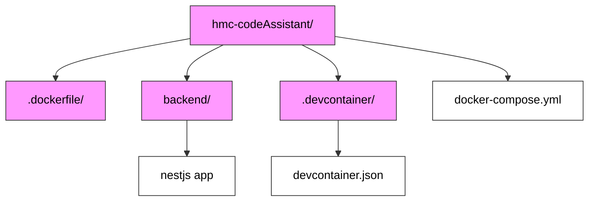

Let me help you set up your GitHub Codespaces environment with proper dev container configuration. 

> First, let's understand the structure we're aiming for:



Create the .devcontainer folder and devcontainer.json file

```bash
mkdir -p .devcontainer
touch .devcontainer/devcontainer.json
```

> Configure your devcontainer.json with NestJS support

```json
{
  "name": "Node.js",
  "build": {
    "dockerfile": ".dockerfile/Dockerfile",
    "context": "..",
    "args": {}
  },
  "features": {
    "ghcr.io/devcontainers/features/node:2": {}
  },
  "workspaceMount": "/workspaces/hmc-codeAssistant",
  "workspaceFolder": "/workspaces/hmc-codeAssistant/backend",
  "containerUser": "node",
  "postCreateCommand": "yarn install --cwd backend",
  "forwardPorts": [3000],
  "customizations": {
    "vscode": {
      "extensions": [
        "esbenp.prettier-vscode",
        "dbaeumer.vscode-eslint",
        "johnpapa.vscode-peacock",
        "PKief.material-icon-theme",
        "eamodio.gitlens"
      ]
    }
  }
}
```

Update your Dockerfile to support NestJS

```dockerfile
FROM mcr.microsoft.com/vscode/devcontainers/base:debian
ARG VARIANT="16-bullseye"

# Install Node.js
RUN if [ "${TARGETARCH}" == "arm64" ]; then \
curl -fsSL https://deb.nodesource.com/setup_${VARIANT} | bash - && \
apt-get install -y nodejs && \
rm -rf /var/lib/apt/lists/* && \
npm install -g @nestjs/cli; \
else \
curl -fsSL https://deb.nodesource.com/setup_${VARIANT} | bash - && \
apt-get install -y nodejs && \
rm -rf /var/lib/apt/lists/* && \
npm install -g @nestjs/cli; \
fi

# Set working directory to /workspaces/hmc-codeAssistant/backend
WORKDIR /workspaces/hmc-codeAssistant/backend

# Copy package*.json files
COPY backend/package*.json ./

# Install dependencies
RUN npm ci

# Copy remaining files
COPY backend .
```

Key points about this configuration:

- The workspaceFolder points directly to your backend directory where NestJS lives
- postCreateCommand installs dependencies after container creation
- The Dockerfile installs Node.js and NestJS CLI globally
- All paths are relative to the repository root

After setting this up:

Commit all changes

```bash
git add .
git commit -m "Add devcontainer configuration"
git push origin main
```

Create a codespace from your repository- Go to your repository on GitHub
- Click the green "Code" button
- Select "Codespaces" tab
- Click "New codespace"

Configure WebStorm- Install the "Remote Development" plugin
- Connect to your codespace using SSH
- Map your local project to the remote path

Important notes- Your existing docker-compose.yml will still work alongside this configuration
- The dev container provides a consistent environment for all developers
- WebStorm will use the same environment as your codespace
- Any changes to devcontainer.json require rebuilding the codespace

This setup ensures that both your local WebStorm and remote codespace environments are properly configured for NestJS development.